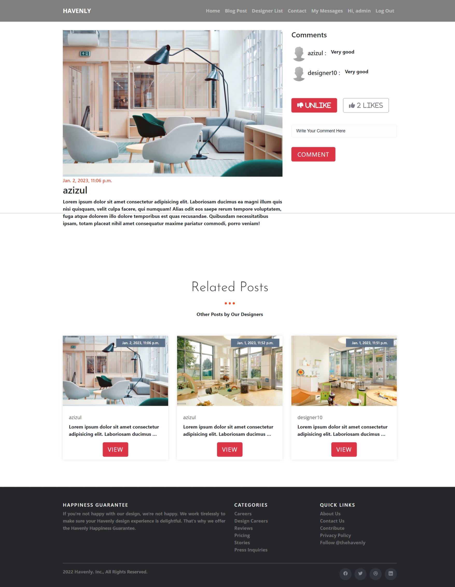

# Havenly Interior Designer Hiring Platform
 
Havenly is a platform where users can find registered interior designers. Designers can post their designs. Users can message designers. Designers can reply and discuss. Tawk.to chat API is used to provide customer support.
 
 **Note: Havenly is a registered trademark of Havenly Inc. We do not own the name Havenly. The name Havenly was chosen as it is a recognizable name.**
 
 If you have any inquary, please feel free to contact us.

 This project was built using Django.

For security reasons, Tawk.to script was removed and Django secret was commented out.

This project is kind of a Frankenstein of my other projects. The code is not as clean as I would have liked.

<i>Requirements:</i>
1. Python
2. Pip
3. Django
4. django-crispy-forms
5. six
6. pillow

Run: <br>
```bash
pip install django django-crispy-forms six pillow crispy-bootstrap5
```

<br>

To run this application, go to the project folder and open a terminal window.
Run: <br>
```
python manage.py runserver
```

## Features

- Users can post their designs
- Users can message designers
- Designers can reply and discuss
- Tawk.to chat API is used to provide customer support
- Users can login and logout
- Users can contact admins
- Desiners can add new designs and edit existing ones

## Contact

Contact me if you have any questions.

Email: <info@sajidifti.com>

## UI Screenshots

### Home


### Signin


### Signup


### All Designs


### View Design



### View Designer


### Profile


### Add Design


### Edit Design


### Messages

